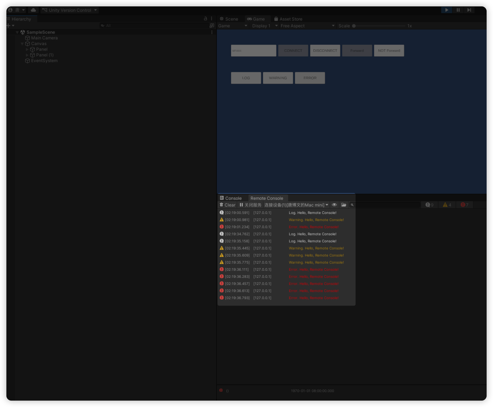
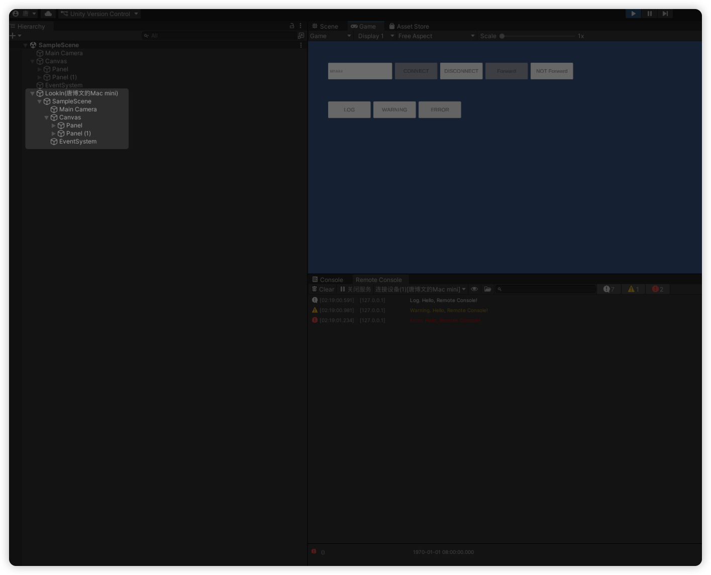
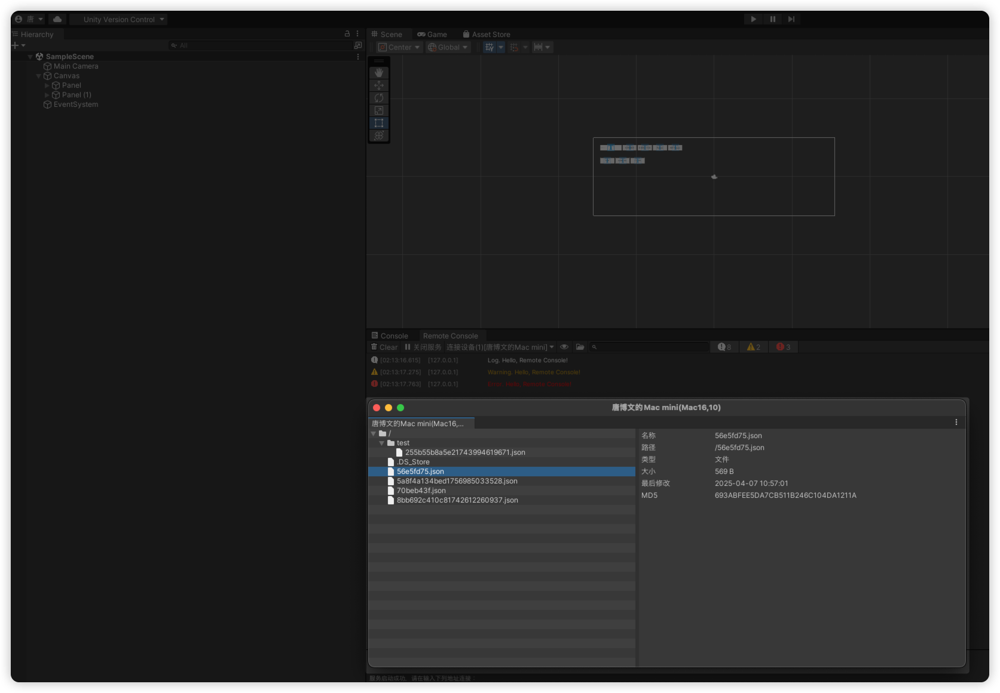

# RemoteConsole 概述

RemoteConsole 是一个面向 Unity 项目的远程调试工具合集，提供统一的“远程日志采集”“远程游戏界面预览（LookIn）”“远程文件浏览与校验”能力，帮助团队在真机环境下快速定位问题、还原现场并完成数据校验。

## 背景与痛点

- 真机问题难复现：设备端崩溃/卡顿/界面异常在编辑器中重现困难，定位成本高。
- 日志与状态割裂：仅有日志无法还原场景层级、激活状态、组件关系，交叉排查耗时。
- 资源校验繁琐：文件完整性与一致性需要手工拷贝/校验，MD5 对比不统一、效率低。
- 联调链路冗长：远程抓取信息依赖多工具与步骤，团队成员重复配置环境，沟通成本高。
- 跨平台差异：不同平台路径/权限/运行环境差异导致排障复杂，缺少统一视图。

## 功能一览

- 远程日志：设备端实时把 Unity 日志推送到编辑器端显示，支持按设备筛选。
- LookIn：远程游戏界面查看。设备端上报场景节点信息，编辑器端一键将视图生成到当前场景下的 `LookIn(...)` 根节点，便于预览与检查。
- 文件浏览：浏览设备端持久化目录，支持目录同步（按需拉取子目录与文件）与文件 MD5 获取，并在右侧详情面板显示字段与 MD5。

为此，RemoteConsole 在“远程日志”基础上增加了 LookIn 与文件浏览：前者把设备端场景结构投射到编辑器场景中，后者提供可视化的目录同步与 MD5 校验，显著缩短问题定位与验证闭环。

## 功能截图

- 远程日志
  
  

- LookIn（远程界面预览）
  
  

- 远程文件浏览
  
  

## 集成与快速开始（设备端）

使用 `RCLogManager` 单例进行连接与日志转发，参考 `Assets/Script/Sample.cs`。

```csharp
using RConsole.Runtime;
using UnityEngine;

public class Example : MonoBehaviour
{
    public void ConnectToEditor(string ip)
    {
        RCLogManager.Instance.Connect(ip); // 默认端口 13337，路径 /remote-console
    }

    public void Disconnect()
    {
        RCLogManager.Instance.Disconnect();
    }

    public void StartForwarding()
    {
        RCLogManager.Instance.ForwardingUnityLog();
    }

    public void StopForwarding()
    {
        RCLogManager.Instance.StopForwardingUnityLog();
    }
}
```

**常用状态**

- `RCLogManager.Instance.IsConnected`：是否已连接到编辑器。
- `RCLogManager.Instance.IsCapturingLogs`：是否正在转发 Unity 日志。

## 编辑器端操作指南

- 远程日志：打开主窗口，选择或筛选设备后查看实时日志。
- LookIn：在主窗口中执行“查看当前场景”（或代码触发 `RConsoleCtrl.Instance.FetchLookin()`），编辑器端自动在场景中创建 `LookIn(设备名)` 根并生成层级视图。
- 文件浏览：打开文件浏览器窗口（菜单或代码触发 `RConsole.Editor.RConsoleFileBrowser.ShowWindow()`）。
  - 左侧为树形目录/文件；右键目录选择“同步”可拉取该目录下的子项并动态追加。
  - 右键文件选择“获取信息”获取 MD5，返回后在右侧详情面板显示。
  - 右侧详情以“标题 - 值”排版展示：名称、路径、类型、大小（自动转换至 GB/MB/KB）、最后修改时间、MD5（文件显示）。
  - 支持拖拽调整左右面板宽度，展开状态在同步后保持。

## 网络与平台要求

- 设备与 Mac 必须在同一局域网，且网络不启用客户端隔离。
- Mac 防火墙/安全软件需允许端口 `13337` 入站访问。
- iOS 设备需要本地网络权限（`Info.plist` 的 `NSLocalNetworkUsageDescription` 说明）。
- 若使用 `ws://`，iOS 可能受 ATS 限制；开发阶段可在 `Info.plist` 添加例外，生产建议使用 `wss://`。

## 常见问题（FAQ）

- 连接卡住或失败：
  - 确认设备端没有使用 `127.0.0.1/localhost`，而是使用 Mac 的局域网 IP。
  - 检查端口 `13337` 是否被防火墙阻止，编辑器端是否已启动服务。
  - iOS 需开启本地网络权限；如使用 `ws://`，请根据需要添加 ATS 例外或改用 `wss://`。

---

如需更详细的接入示例或特定平台的配置说明，请反馈你的目标与场景，我可以补充相应文档与示例。